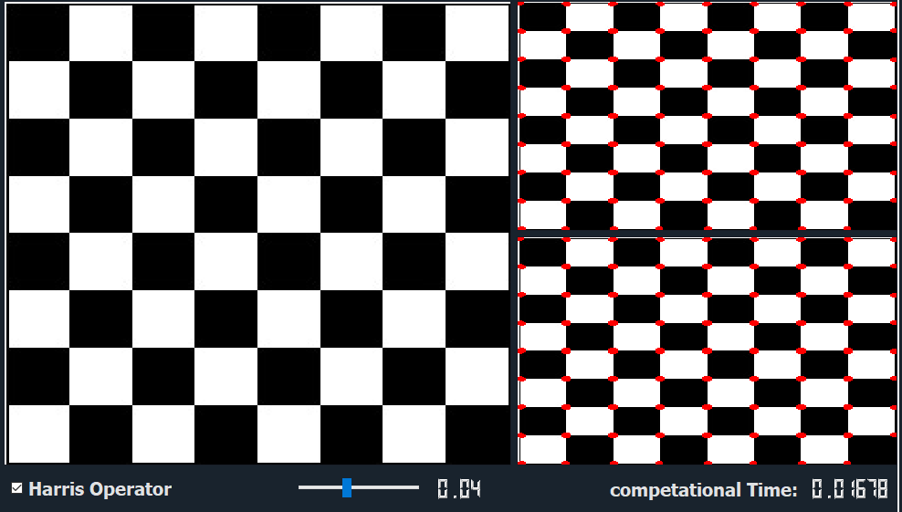
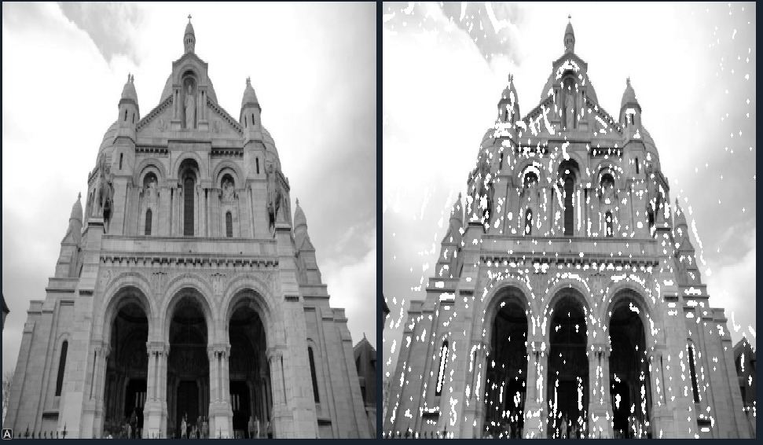
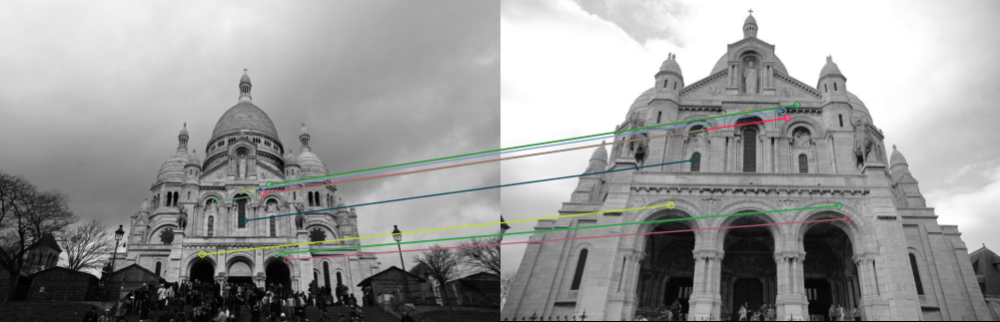
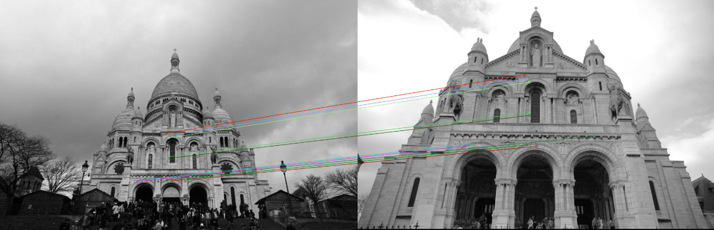

# Image Descriptor
## Description
Image Descriptor is a desktop application built with PyQt to perform corner detection on grayscale and color images and calculate computational time and apply features extraction and matching images on grayscale and color images. The application implements harris operator and lambda minus for corner detection grayscale images and color images. For matching two images,first features extraction using SIFT and then it supports applying these methods SSD and NCC.

## Table of Contents
1. [Installation](#installation)
2. [Usage](#usage)
3. [Features](#features)
4. [Contributors](#Contributors)

## Installation
To install the project, clone the repository and install the dependencies:

```bash
# Clone the repository
git clone https://github.com/Zoz-HF/Image_Descriptor

# Navigate to the project directory
cd Image_Descriptor
```

## Usage
To run the application, use the following command:

```bash
python index.py
```

## Features
### Corner Detection For Grayscale and Color Images
- Harris Operator 
  
- Lambda Minus
  

### Features Extraction and Matching For Grayscale and Color Images
- SIFT
  
- SSD
  
- NCC
  


## Contributors

- [Ziyad El Fayoumy](https://github.com/Zoz-HF)
- [Assem Hussein](https://github.com/RushingBlast)
- [Mohamed Sayed Diab](https://github.com/MohamedSayedDiab)
- [Abdel Rahman Shawky](https://github.com/AbdulrahmanGhitani)
- [Omar Shaban](https://github.com/omarshaban02)
